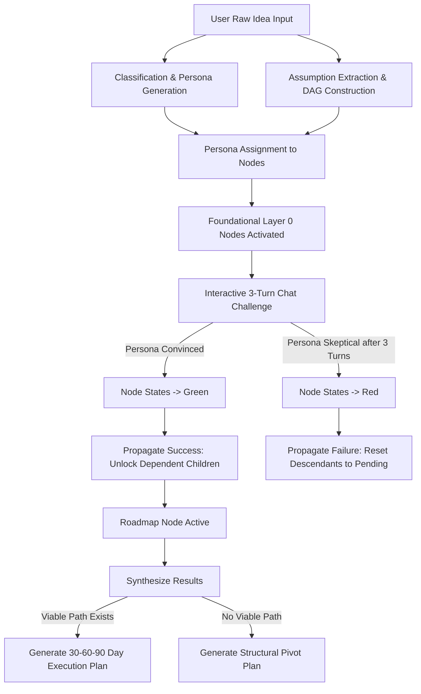

# Forge: Zero-to-One Idea Validation Engine

Forge is an adversarial idea-validation engine designed to stress-test early-stage business and product concepts. By mapping a raw idea into a Directed Acyclic Graph (DAG) of foundational assumptions across Desirability, Feasibility, and Viability dimensions, Forge subjects innovators to real-time interactive cross-examinations with customized, domain-tailored AI agent personas. This process translates raw ideas into validated execution plans or structured pivot recommendations.

---

## 1. Problem Understanding

### Target User
The target users are early-stage innovators:
- **Startup Founders**: Entrepreneurs aiming to validate new business models, product concepts, and value propositions before deploying capital.
- **Student Teams**: Individuals participating in academic or hackathon settings (such as the USAII Global AI Hackathon) needing to quickly formulate, stress-test, and refine project directions.
- **Researchers & Social Entrepreneurs**: Creators attempting to validate the societal impact, operational feasibility, and sustainability of research projects or social initiatives.

### Real-World Problem
The "Zero-to-One" phase of any venture is plagued by a high failure rate due to several core issues:
- **Confirmation Bias**: Creators fall in love with their ideas and actively seek information that validates their initial biases, ignoring hidden risks.
- **Invisible Assumptions**: Early-stage ideas rest on critical dependencies (e.g., customer behavior, technical feasibility, unit economics) that are rarely separated out or tested individually.
- **Inaccessibility of Adversarial Feedback**: Assembling a board of diverse, critical industry experts (such as skeptical venture capitalists, competing founders, domain-expert technicians, and picky target customers) is extremely expensive, time-consuming, and functionally impossible for most early-stage builders.

Forge addresses this gap by converting validation from a passive exercise (such as filling out static canvases) into an active, gamified, and adversarial simulation where assumptions are decomposed and rigorously stress-tested.

---

## 2. AI Reasoning

### Why AI is the Right Tool
AI is uniquely suited to solve the accessibility and dynamic generation problem of idea validation for several reasons:
- **Role-Play and Adversarial Perspective Simulation**: LLMs can assume highly specialized, persistent personas (e.g., a cynical enterprise CTO, a cost-sensitive consumer, or a rigorous domain scientist) based on minimal contextual input.
- **Unstructured to Structured Translation**: AI models can ingest a short, raw text prompt describing a concept and automatically extract the implicit, testable assumptions, categorizing them across business-standard dimensions.
- **Logical Graph Construction**: LLMs can evaluate dependencies between assumptions and organize them into a structured Directed Acyclic Graph (DAG), mapping out which assumptions are foundational (must be true first) and which are dependent.
- **Scalability**: Forge can instantiate custom feedback boards instantly for any vertical, lowering the barrier to expert-level stress testing.

---

## 3. Solution Coherence

The logical flow of the application ensures that validation is structural rather than abstract.

### Logical Architecture Flow


### Detailed Component Walkthrough

1. **Intake and Graph Initialization**
   - The user inputs a raw concept in the frontend component [idea-intake.tsx](file:///Users/apurvaarya/Documents/Projects/USAII/forge-submission/frontend/components/idea-intake.tsx).
   - The backend endpoint `/api/idea` in [main.py](file:///Users/apurvaarya/Documents/Projects/USAII/forge-submission/backend/main.py) calls [build_graph](file:///Users/apurvaarya/Documents/Projects/USAII/forge-submission/backend/graph_builder.py#L113-L145), which leverages an LLM to:
     - Classify the project type (startup, class project, research project, or social initiative).
     - Generate four custom personas (e.g., Series A Investor, Skeptical User, Industry Veteran, Competitor).
     - Decompose the concept into 5–8 specific, testable assumption nodes.
     - Formulate dependency mappings (`depends_on`) to construct a DAG.
     - Assign each node a corresponding persona.
   - Longest-path layering is calculated via `compute_layers` in [graph_builder.py](file:///Users/apurvaarya/Documents/Projects/USAII/forge-submission/backend/graph_builder.py#L56-L77), placing foundational assumptions at the bottom (Layer 0) and the special `roadmap` node at the top.
   - Layer 0 nodes are initialized to the `active` state, making them open for user challenge. All other nodes remain `pending`.

2. **The Defense Arena (Interactive Evaluation)**
   - The user selects an `active` node on the 3D interactive graph ([dependency-graph.tsx](file:///Users/apurvaarya/Documents/Projects/USAII/forge-submission/frontend/components/dependency-graph.tsx)).
   - The user chats with the assigned persona in the chat interface managed by [node-details-panel.tsx](file:///Users/apurvaarya/Documents/Projects/USAII/forge-submission/frontend/components/node-details-panel.tsx).
   - Each message is processed by `/api/chat` via [chat_turn](file:///Users/apurvaarya/Documents/Projects/USAII/forge-submission/backend/chat_handler.py#L131-L206).
   - **Dialog Constraints**: A maximum of three exchanges is permitted. If the persona is convinced at any point (verdict parses `convinced: true`), the node turns `green`. If the third exchange finishes without conviction, the persona issues a final verdict, turning the node `red`.

3. **State Propagation and Graph Pruning**
   - The state transition rules are handled in [chat_handler.py](file:///Users/apurvaarya/Documents/Projects/USAII/forge-submission/backend/chat_handler.py):
     - **Success Propagation**: When a node is successfully defended (`green`), the system checks if all parent dependencies for its child nodes are also `green`. If so, those child nodes are updated from `pending` to `active`, unlocking them for verification.
     - **Failure Cascading**: If a node fails (`red`), the system prunes the branch. All descendants (nodes that transitively depend on this node) are collapsed back to `pending`, their chat histories are cleared, and their exchange counts are reset. This enforces structural integrity, preventing the user from building on top of a failed foundation.

4. **Strategic Synthesis**
   - Once all tips of the graph are resolved, the special `roadmap` node becomes active.
   - `/api/synthesize` in [synthesizer.py](file:///Users/apurvaarya/Documents/Projects/USAII/forge-submission/backend/synthesizer.py#L63-L76) runs a final evaluation:
     - **Plan Generation**: If at least one root-to-tip path was navigated successfully (at least one root was validated), the system compiles a concrete 30-60-90 day execution plan based on the validated (`green`) assumptions.
     - **Pivot Recommendation**: If the foundational assumptions failed, the system advises a pivot, explicitly highlighting the failed assumptions and proposing concrete alternatives (e.g., smaller scopes, different target audiences, or altered delivery mechanics).

---

## 4. Responsible AI

Developing an automated validator carries risks that require architectural mitigations. Forge implements specific design decisions to enforce Responsible AI practices:

### AI Risks & Mitigations

- **Risk 1: The "Yes-Man" Effect (Hallucinatory Flattery)**
  - *Risk*: Language models are naturally conversational and often try to please the user, which can result in false validation of weak business plans.
  - *Mitigation*: The system prompt in [chat_handler.py](file:///Users/apurvaarya/Documents/Projects/USAII/forge-submission/backend/chat_handler.py#L24-L46) explicitly instructs personas to remain highly skeptical, reject vague promises, and demand concrete evidence. Furthermore, the model must end its response with a strict, parsed JSON block (`VERDICT:{"convinced": true/false, "final": false}`), removing sentiment bias from the backend state machine.

- **Risk 2: Toxic Criticism and Discouragement**
  - *Risk*: An adversarial prompt could lead the AI to adopt a hostile tone that damages user morale.
  - *Mitigation*: Prompt templates instruct personas to be "skeptical but fair." They are evaluated on logical consistency and must explain what evidence or plan would change their mind, maintaining a constructive dialectic.

- **Risk 3: Unbounded Context and Circular Reasoning**
  - *Risk*: A user could endlessly debate an AI agent until it finally concedes due to context drift.
  - *Mitigation*: A hard constraint of three turns is coded directly into the state model [models.py](file:///Users/apurvaarya/Documents/Projects/USAII/forge-submission/backend/models.py#L19). The backend refuses further chat turns once `exchanges_used` hits 3, forcing a final decision.

- **Risk 4: Intellectual Property Leakage**
  - *Risk*: Raw business concepts could be integrated into public models.
  - *Mitigation*: System configurations avoid persistent cloud training. Using API-based inference through Groq isolates the query contexts, ensuring user submissions are processed in-flight and not added to training corpuses.

---

## 5. Human Oversight

Forge is designed as a decision-support system, not an automated executor. The human is kept in the loop through key touchpoints:

- **Evidence Provisioning**: The AI cannot verify facts outside the simulation. The user must provide the research, pilot results, data, or engineering designs to convince the persona.
- **Pivot Decisiveness**: If the system recommends a pivot, the human developer selects which revised assumption to pursue or whether to override a failed validation pathway.
- **Human-in-the-Loop Implementation**: The final 30-60-90 day plan is a recommendation. The human operator is responsible for executing the steps, validating metrics, and carrying out the physical tasks.

---

## 6. Project Architecture & Setup

### Backend Directory Layout
- [main.py](file:///Users/apurvaarya/Documents/Projects/USAII/forge-submission/backend/main.py): Entrypoint setting up the FastAPI server, CORS middleware, and routing endpoints.
- [models.py](file:///Users/apurvaarya/Documents/Projects/USAII/forge-submission/backend/models.py): Defines the data structures: [Node](file:///Users/apurvaarya/Documents/Projects/USAII/forge-submission/backend/models.py#L7-L20) representing assumption cards, [Persona](file:///Users/apurvaarya/Documents/Projects/USAII/forge-submission/backend/models.py#L22-L28) representing the critics, and [GraphState](file:///Users/apurvaarya/Documents/Projects/USAII/forge-submission/backend/models.py#L30-L36) representing the full user DAG.
- [graph_builder.py](file:///Users/apurvaarya/Documents/Projects/USAII/forge-submission/backend/graph_builder.py): Contains logic for parsing raw inputs, running the longest-path layering algorithm to set nodes in order, and building the DAG.
- [chat_handler.py](file:///Users/apurvaarya/Documents/Projects/USAII/forge-submission/backend/chat_handler.py): Runs the conversation logic, handles the LLM completions, parses verdicts, and runs success/failure propagation.
- [synthesizer.py](file:///Users/apurvaarya/Documents/Projects/USAII/forge-submission/backend/synthesizer.py): Orchestrates the post-validation reporting logic, producing structured execution plans or pivot guidelines.
- [groq_client.py](file:///Users/apurvaarya/Documents/Projects/USAII/forge-submission/backend/groq_client.py): Standardizes connection parameters and JSON validation for model calls.
- [state.py](file:///Users/apurvaarya/Documents/Projects/USAII/forge-submission/backend/state.py): Manages simple in-memory session persistence.

### Frontend Directory Layout
- [app/page.tsx](file:///Users/apurvaarya/Documents/Projects/USAII/forge-submission/frontend/app/page.tsx): Main application shell coordinating sidebar sections and modal states.
- [components/dependency-graph.tsx](file:///Users/apurvaarya/Documents/Projects/USAII/forge-submission/frontend/components/dependency-graph.tsx): Visualizes the DAG structure using interactive 3D force-directed nodes.
- [components/node-details-panel.tsx](file:///Users/apurvaarya/Documents/Projects/USAII/forge-submission/frontend/components/node-details-panel.tsx): Houses the messaging panel, showing turn usage, remaining budget, and validation verdicts.
- [components/synthesis-report.tsx](file:///Users/apurvaarya/Documents/Projects/USAII/forge-submission/frontend/components/synthesis-report.tsx): Renders the execution roadmap or pivot alternatives upon validation completion.

---

## Getting Started

### Prerequisites
- Python 3.13+
- Node.js 18+
- PNPM (preferred) or NPM
- A Groq API key (configured as `GROQ_API_KEY`)

### Running the Backend
1. Navigate to the backend directory:
   ```bash
   cd backend
   ```
2. Create a virtual environment and install dependencies:
   ```bash
   python -m venv .venv
   source .venv/bin/activate
   pip install fastapi uvicorn groq pydantic python-dotenv
   ```
3. Set your environment variables in a `.env` file:
   ```env
   GROQ_API_KEY=your-api-key-here
   ```
4. Run the FastAPI development server:
   ```bash
   uvicorn main:app --reload --port 8000
   ```

### Running the Frontend
1. Navigate to the frontend directory:
   ```bash
   cd frontend
   ```
2. Install dependencies:
   ```bash
   pnpm install
   # or
   npm install
   ```
3. Run the Next.js development server:
   ```bash
   pnpm dev
   # or
   npm run dev
   ```
4. Open your browser and navigate to `http://localhost:3000`.
